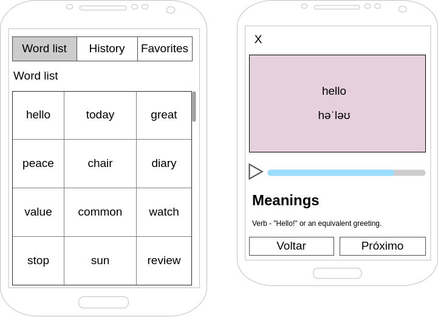

# Mobile Challenge 🏅 - Pilar

> This is a [challenge](https://lab.coodesh.com/challenges/apps/dictionary) by [Coodesh](https://coodesh.com/)

## Sobre

- Dictionary
- Um App para listar palavras em inglês (utlizando a api [Words API](https://www.wordsapi.com)), e exibir suas definições, sinônimos, derivação e afins
- [Tecnologias usadas](#techs)
- [Como instalar e usar](#como-instalar-e-usar)

## Checkpoints

### Obrigatório - Você deverá atender aos seguintes casos de uso

- [ ] Como usuário, devo ser capaz de visualizar uma lista de palavras com rolagem infinita
- [ ] Como usuário, devo ser capaz de visualizar uma palavra, significados e a fonética
- [ ] Como usuário, devo ser capaz de salvar a palavra como favorito
- [ ] Como usuário, devo ser capaz de remover a palavra como favorito
- [ ] Como usuário, devo ser capaz de visitar uma lista com as palavras que já vi anteriormente
- [ ] A API não possui endpoint com a lista de palavras. Essa lista pode ser carregada em memória ou ser salva em banco de dados local ou remoto
- [ ] Salvar em cache o resultado das requisições ao Words API, para agilizar a resposta em caso de buscas com parâmetros repetidos
- [ ] Seguir o wireframe para a página de listagem dos dados. Pode-se alterar a posição dos itens, mantendo as funcionalidades solicitadas
  - 

### Diferencial

- [ ] Implementar um tocador de audio utilizando, por exemplo, <https://responsivevoice.org/api> ou recursos nativos;
- [ ] Utilizar alguma ferramenta de Injeção de Dependência;
- [ ] Escrever Unit Tests ou E2E Test. Escolher a melhor abordagem e biblioteca;
- [ ] Implementar login com usuário e senha e associar os favoritos e histórico ao ID do usuário, salvando essa informação em banco de dados local ou remoto

## [Techs](#sobre)

### Linguagem/Framework

- Flutter(Dart)

### Tecnologias usadas

- [Firebase](https://firebase.google.com/?hl=pt)
- [Sentry](https://sentry.io)
- [Modular](https://modular.flutterando.com.br/docs/intro/)
- [LottieFiles](https://lottiefiles.com)
- [RapidAPI](https://rapidapi.com)
- [Codemagic](https://codemagic.io/start/)
- [Mason CLI](https://github.com/mazieri/bricks)

> Packages/Plugins

- [flutter_modular](https://pub.dev/packages/flutter_modular)
- [uno](https://pub.dev/packages/uno)
- [sentry_flutter](https://pub.dev/packages/sentry_flutter)
- [firebase_core](https://pub.dev/packages/firebase_core)
- [firebase_analytics](https://pub.dev/packages/firebase_analytics)
- [firebase_remote_config](https://pub.dev/packages/firebase_remote_config)
- [mobx](https://pub.dev/packages/mobx)
- [flutter_mobx](https://pub.dev/packages/flutter_mobx)
- [lottie](https://pub.dev/packages/lottie)
- [shared_preferences](https://pub.dev/packages/shared_preferences)

> Dev Packages/Plugins

- [mobx_codegen](https://pub.dev/packages/mobx_codegen)
- [build_runner](https://pub.dev/packages/build_runner)
- [flutter_native_splash](https://pub.dev/packages/flutter_native_splash)
- [icons_launcher](https://pub.dev/packages/icons_launcher)
- [package_rename](https://pub.dev/packages/package_rename)

## [Como instalar e usar](#sobre)
